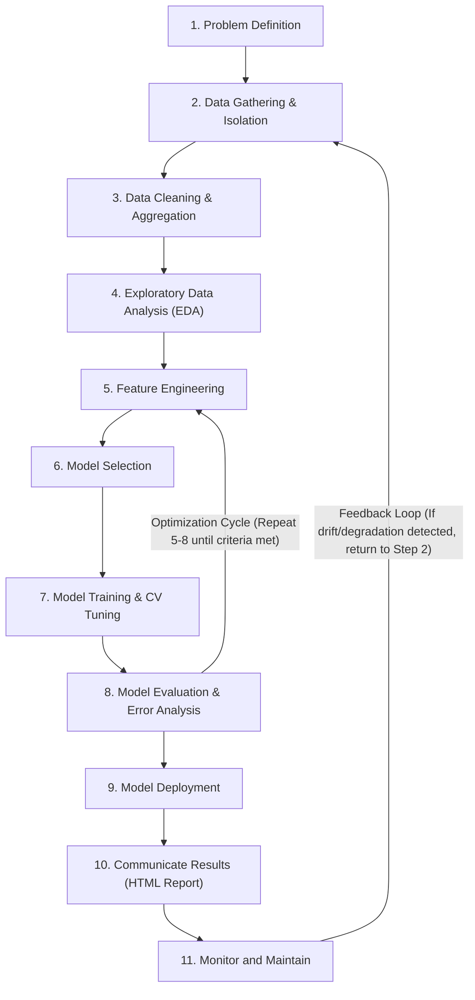

# Project Workflow: Student Risk & Performance Segmentation (Supervised Learning)

**Project:** Student Risk & Performance Segmentation for Targeted Academic Support Planning  
**Dataset Source:** [Kaggle MOOC Dataset (HarvardX-MITx Person-Course Academic Year 2013)](https://www.kaggle.com/datasets/kanikanarang94/mooc-dataset)  
**Unit of Analysis:** One row per student (`userid_DI`)  
**Task Type:** Supervised Learning (Binary Classification with Calibrated Probabilities & Operational Risk Tiering)  
**Governance & Anti-Leakage Mandate:** Known course outcome fields (`certified`, `grade`, `incomplete_flag`, `explored`) must be used exclusively as ground-truth target labels ($y$) and strictly isolated. They must never enter the feature matrix ($X$), influence feature engineering or imputation, or leak across train/validation/test splits. All preprocessing, encoding, scaling, and hyperparameter tuning must be fitted strictly on training splits ($X_{train}$).

---

## Complete Data Science Workflow Execution Plan



---

### Step 1: Problem Definition
- **Workflow.md Specification:**
  - *Define the problem, objective, target outcome, task type, and success criteria.*
- **What Must Be Done:**
  - **Define the Problem:** Massive Open Online Courses (MOOCs) suffer from severe non-completion rates (~96% drop out). Rather than treating all learners homogeneously, learning support teams require early, calibrated signals to identify students who are on the cusp of completion or in critical need of support.
  - **Define the Objective:** Build a production-grade supervised machine learning pipeline to predict student course completion and segment students into actionable, calibrated risk tiers to inform proactive, non-punitive academic interventions.
  - **Define Target Outcome:** `certified_student` $\in \{0, 1\}$, where 1 indicates the student earned a certificate in at least one enrolled course, and 0 represents non-completion. Continuous predicted probabilities $\hat{p} = P(certified=1)$ are mapped to operational risk tiers.
  - **Define Task Type:** Supervised binary classification with probability calibration, threshold optimization, and risk segmentation.
  - **Define Success Criteria:** Establish clear, quantifiable pre-modeling criteria:
    - *Discrimination:* Area Under ROC Curve (ROC-AUC $\ge 0.85$) and Area Under Precision-Recall Curve (PR-AUC $\ge 0.35$ against a ~4.1% baseline).
    - *Probabilistic Calibration:* Brier Score $\le 0.05$ and verified empirical calibration across deciles.
    - *Anti-Leakage Integrity:* Complete isolation of outcome variables (`certified`, `grade`, `incomplete_flag`, `explored`) from feature matrix $X$; zero leakage across splits.
    - *Subgroup Fairness & Equity:* Performance parity across demographic subgroups (gender, education level, geographic regions) with equal opportunity diagnostics.
    - *Operational Actionability:* Calibrate threshold boundaries to segment students into three operational tiers: High Risk (Tier 3), Moderate Risk (Tier 2), and Low Risk / Likely Completers (Tier 1).
- **Why It Is Needed:** Clear problem framing prevents arbitrary feature construction, improper metrics (such as naive accuracy in 96:4 imbalanced data), and punitive or gatekeeping misapplications.
- **How Decisions Will Be Made:** Acceptance decisions are evaluated against predefined quantitative thresholds. The system is explicitly designed for decision support (advising nudges, prerequisite help) and prohibited from automated adverse actions (e.g., student deregistration).
- **What Outputs Will Be Created:**
  - Project definition and formal criteria: `data/processed/problem_definition.json`
  - Operational problem definition and ethical guidelines documented in the HTML report.

---

### Step 2: Data Gathering & Label Separation (Anti-Leakage Isolation)
- **Workflow.md Specification:**
  - *Gather and load relevant data from reliable sources; record its source, scope, and limitations.*
- **What Must Be Done:**
  - **Gather and Load Relevant Data:** Ingest the raw HarvardX-MITx Person-Course Academic Year 2013 dataset (416,921 enrollment records across 22 columns) from Kaggle.
  - **Record Its Source:** Verify provenance URL, original publication context, file metadata, byte size (55.94 MB), and SHA-256 cryptographic hash (`24858a3afe182d4a17b5083ed4ffcd6ced622821fc37626932628240b31773f9`).
  - **Record Its Scope:** 17 unique courses, 416,921 enrollments, 335,650 unique learners (`userid_DI`), covering activity logs (clicks, active days, video plays, chapters, forum posts) and self-reported demographics.
  - **Record Its Limitations:** Historical 2012–2013 open-enrollment MOOC context, self-reported demographic sparsity, lack of timestamp-level fine-grained clickstream sequences, video logging unavailable in earlier course iterations (sentinel value 197757).
  - **Enforce Anti-Leakage Separation:** Classify fields into identifiers, behavioral features, demographic attributes, and outcome labels. Physically separate all target variables into an isolated label store.
- **Why It Is Needed:** Verifying source and schema prevents mistaken assumptions. Physical quarantine of outcome variables guarantees zero target leakage into downstream feature engineering and modeling.
- **How Decisions Will Be Made:** Outcome variables (`certified`, `grade`, `incomplete_flag`, `explored`) are immediately quarantined into `data/labels/raw_targets.parquet`. Non-outcome fields are saved to `data/processed/raw_features.parquet`.
- **What Outputs Will Be Created:**
  - Data provenance and SHA-256 checksum: `data/processed/data_provenance.json`
  - Data dictionary with explicit variable roles: `data/processed/data_dictionary.csv`
  - Isolated non-target raw feature store: `data/processed/raw_features.parquet`
  - Isolated ground-truth label store: `data/labels/raw_targets.parquet`

---

### Step 3: Data Cleaning & Student-Level Aggregation
- **Workflow.md Specification:**
  - *Clean the data by handling missing values, duplicates, incorrect data types, and inconsistent records.*
- **What Must Be Done:**
  - **Handling Duplicates:** Audit and remove substantive duplicate enrollment records.
  - **Handling Incorrect Data Types & Sentinels:** Convert string date fields (`start_time_DI`, `last_event_DI`) to ISO datetime. Identify documented video sentinel values (`nplay_video == 197757`), convert to `NaN`, and generate an explicit indicator (`video_data_available`).
  - **Handling Inconsistent Records & Outliers:** Audit age anomalies (e.g., age $< 10$ or $> 100$), setting out-of-bounds records to missing while tracking an audit flag. Audit temporal inversions (`last_event_DI < start_time_DI`).
  - **Handling Missing Values:** Document missingness rates (e.g., gender, LoE_DI, country) without premature or naive imputation prior to train/test splitting.
  - **Student-Level Aggregation:** Aggregate repeated course enrollments into exactly one row per student (`userid_DI`). Sum engagement counts, compute means/maximums across courses, derive highest level of education via ordinal hierarchy, and define student ground truth: `certified_student = max(certified)`.
- **Why It Is Needed:** Modeling multi-course records directly creates student-level contamination across splits and distorts behavioral distributions. Clean aggregation ensures consistent, robust unit-of-analysis modeling.
- **How Decisions Will Be Made:** Rules are derived from documented schema and empirical validation. All record transitions are logged in an immutable audit ledger.
- **What Outputs Will Be Created:**
  - Cleaned student-level feature matrix: `data/processed/students_cleaned.parquet`
  - Cleaned student-level ground-truth labels: `data/labels/student_labels.parquet`
  - Explicit cleaning and aggregation rules: `data/processed/cleaning_rules.json`
  - Audit of record transitions and anomaly counts: `data/processed/cleaning_audit.json`

---

### Step 4: Exploratory Data Analysis (EDA) & Feature Screening
- **Workflow.md Specification:**
  - *Explore data distributions, outliers, patterns, relationships, correlations, and important features.*
- **What Must Be Done:**
  - **Data Distributions & Sparsity:** Analyze distributions of behavioral variables (`nevents`, `ndays_act`, `nchapters`, `nplay_video`, `nforum_posts`). Document extreme right-skewness and heavy tails.
  - **Outliers:** Evaluate extreme values in event counts (up to 53,180 events) and active days (up to 582 days), determining the need for non-linear log transforms and robust scaling.
  - **Patterns & Relationships:** Analyze relationships between student engagement metrics and course completion. Inspect class imbalance (4.135% completers, 95.865% non-completers).
  - **Correlations & Multicollinearity:** Compute Spearman and Pearson correlation matrices across engagement features.
  - **Important Features & Statistical Screening:** Compute Point-Biserial correlations, Mutual Information scores, and Mann-Whitney U tests for numeric features against `certified_student`. Compute Chi-squared tests and odds ratios for categorical demographics. Confirm absence of perfect predictors (leakage check).
- **Why It Is Needed:** EDA exposes distribution characteristics, guides appropriate transformation choices, and validates that strong predictors exist without accidental target leakage.
- **How Decisions Will Be Made:** Feature screening results determine whether transformations (log1p) are necessary and confirm that no single feature exhibits an implausibly high correlation ($r > 0.95$).
- **What Outputs Will Be Created:**
  - Population descriptive statistics: `outputs/tables/eda_summary.csv`
  - Feature-label association and leakage screening: `outputs/tables/feature_screening.csv`
  - EDA figures (class imbalance, distributions, correlations, demographics): `outputs/figures/eda/`

---

### Step 5: Feature Engineering & Preprocessing Pipeline
- **Workflow.md Specification:**
  - *Create, transform, and select relevant features; encode or scale data when needed.*
- **What Must Be Done:**
  - **Create Relevant Features:** Engineer domain-informed composite features:
    - `event_intensity`: Average events per active day (`total_events / (total_active_days + 1)`).
    - `video_play_ratio`: Ratio of video interactions to total events.
    - `chapter_intensity`: Chapters accessed per active day.
    - `overall_span_days`: Temporal span between earliest start and latest event date.
    - Activity indicator flags: `has_forum_activity`, `has_multiple_courses`, `date_inversion_records`.
  - **Transform Features:** Apply `log1p` transformation to heavily right-skewed count variables (`total_events`, `total_active_days`, `total_chapters`, `total_video_plays`, `event_intensity`).
  - **Encode Features:** Apply One-Hot Encoding with frequency thresholding (`min_frequency=0.01`) and unknown category handling for categorical demographics (`gender`, `LoE_DI`, `country`).
  - **Scale Data When Needed:** Apply `RobustScaler` for skewed features to withstand extreme interaction outliers, and `StandardScaler` for bounded ratios and numeric indicators.
  - **Split-Disciplined Fitting:** Fit the entire scikit-learn `ColumnTransformer` preprocessing pipeline strictly on $X_{train}$. Apply `.transform()` to validation and test sets.
- **Why It Is Needed:** Data snooping or fitting transformations across all data leaks test statistics (mean, variance, category vocabularies) into training splits, producing over-optimistic performance estimates.
- **How Decisions Will Be Made:** Feature ablation comparisons evaluate raw vs. transformed feature distributions (skewness reduced from 7.51 to 0.44).
- **What Outputs Will Be Created:**
  - Feature definitions and theoretical rationale: `data/processed/feature_definitions.csv`
  - Split metadata and integrity check: `outputs/reproducibility/split_summary.json`
  - Fitted preprocessing pipeline: `models/preprocessing_pipeline.joblib`
  - Processed feature and label partitions: `data/processed/*_features.parquet` and `data/labels/*_labels.parquet`
  - Feature transformation ablation comparison: `outputs/tables/feature_engineering_comparison.csv`

---

### Step 6: Model Selection & Literature Review
- **Workflow.md Specification:**
  - *Review relevant literature and select suitable candidate models based on the problem, data, and prior work.*
- **What Must Be Done:**
  - **Review Relevant Literature:** Synthesize educational data mining (EDM) and learning analytics research (Anderson et al., 2014; Brooks et al., 2015; Gardner & Brooks, 2018; Kizilcec et al., 2013; Niculescu-Mizil & Caruana, 2005). Document findings on behavioral vs. demographic importance and handling severe class imbalance.
  - **Select Suitable Candidate Models:** Compare nine predictive families plus one null baseline. The set is intentionally diverse rather than counting parameter variants as different algorithms:
    1. *Baseline Benchmark:* Dummy Classifier (stratified/prior) establishing empirical lower bounds.
    2. *Regularized Linear Model:* Logistic Regression (L2 / ElasticNet) with balanced and unweighted variants for interpretability.
    3. *Linear Stochastic Gradient Descent (SGD):* ElasticNet penalized SGD for sparse scalable linear modeling.
    4. *Probabilistic Model:* Gaussian Naive Bayes as a fast generative probability benchmark.
    5. *Maximum-Margin Model:* Linear SVM with sigmoid probability calibration and balanced class weights.
    6. *Single Interpretable Tree:* Decision Tree for transparent non-linear rules.
    7. *Bagging Ensemble:* Random Forest for non-linear thresholds and interactions.
    8. *Highly Randomized Tree Ensemble:* Extra Trees to test stronger split randomization than Random Forest.
    9. *Boosting Ensemble:* Histogram-based Gradient Boosted Decision Trees for sequential tabular learning.
    10. *Neural Architecture:* Multi-Layer Perceptron (MLP) for layered non-linear representations.
- **Why It Is Needed:** No single algorithm dominates across tabular imbalanced problems. Comparing diverse model families ensures scientific rigor and prevents architecture bias.
- **How Decisions Will Be Made:** Algorithms are evaluated for their handling of extreme class imbalance (class weighting, boosting loss functions), inference latency, probability calibration, and explainability.
- **What Outputs Will Be Created:**
  - Educational data mining literature review: `outputs/research/literature_review.md`
  - Model selection rationale and architectural trade-offs: `outputs/research/model_selection_rationale.md`
  - Candidate model specifications: `outputs/tables/candidate_models.csv`

---

### Step 7: Model Training & Validation-Set Tuning
- **Workflow.md Specification:**
  - *Split the data into training, validation, and test sets; then train and tune the selected models.*
- **What Must Be Done:**
  - **Split the Data:** Partition the cohort (335,650 students) into Stratified Train (70% = 234,955), Validation (15% = 50,347), and Test (15% = 50,348) splits keyed on `certified_student` to preserve the 4.135% positive completion rate across all subsets.
  - **Train and Tune Selected Models:** Fit every candidate on the fixed stratified training partition. Compare stated parameter variants for Logistic Regression, Random Forest, and HistGradientBoosting; evaluate one research-grounded specification for each additional family.
  - **Probability Support:** Calibrate Linear SVM with three-fold sigmoid calibration inside the training partition so PR-AUC, Brier Score, thresholds, and risk tiers remain comparable.
  - **Track Metrics & Convergence:** Log validation ROC-AUC, PR-AUC, Brier Score, optimal threshold, fit runtime, run status, configuration, and random seed.
- **Why It Is Needed:** A separate validation partition allows configuration selection without consulting the untouched test set, while comparing genuinely different modeling assumptions reduces architecture bias.
- **How Decisions Will Be Made:** Rank successful non-baseline configurations by validation PR-AUC, then validation ROC-AUC, then lower validation Brier Score. Use the test set only after the winner has been selected.
- **What Outputs Will Be Created:**
  - Trained candidate model artifacts: `models/candidates/*.joblib`
  - Hyperparameter tuning and CV metrics: `outputs/tables/model_tuning_results.csv`
  - Training configuration and random seeds: `outputs/reproducibility/training_config.json`
  - Detailed runtime and convergence log: `outputs/logs/model_training_log.csv`

---

### Step 8: Model Evaluation, Error Analysis & Champion Locking
- **Workflow.md Specification:**
  - *Evaluate and compare models on unseen test data using a baseline, task-appropriate metrics, and error analysis.*
- **What Must Be Done:**
  - **Evaluate on Unseen Test Data:** Score all tuned candidate models against the held-out test split (50,348 students), which remained completely untouched throughout training and tuning.
  - **Compare Against Baseline:** Benchmark against the Dummy Baseline (PR-AUC 0.0414, ROC-AUC 0.5000) to demonstrate statistical lift.
  - **Task-Appropriate Metrics:**
    - Discrimination: Area Under ROC Curve (ROC-AUC) and Area Under Precision-Recall Curve (PR-AUC).
    - Calibration: Brier Score and empirical calibration curves across probability deciles.
    - Operational Cutoffs: F1-score, Precision, Recall, and Balanced Accuracy evaluated at default ($\tau = 0.50$) and maximum-F1 optimal threshold ($\tau^*$).
  - **Comprehensive Error Analysis:** Audit False Positives (high-engagement non-completers / auditors) and False Negatives (low-interaction completers). Inspect distribution of misclassified cases to identify behavioral edge cases.
  - **Fairness & Demographic Parity Diagnostics:** Evaluate true positive rate (TPR / Recall) and positive prediction rates across gender, educational attainment, and geographic regions.
  - **Feature Importance:** Compute Permutation Feature Importance over the holdout test set with multiple shuffle repeats.
  - **Lock Champion Model:** Select the champion before test interpretation using validation PR-AUC, validation ROC-AUC, and validation Brier Score in that order. Evaluate all saved candidates on the holdout set for transparent reporting, but do not change the selected champion from test results. Lock the final artifact with a SHA-256 hash.
- **Why It Is Needed:** Unbiased holdout testing verifies generalization. Error analysis and fairness diagnostics prevent harmful biases in educational advising.
- **How Decisions Will Be Made:** The selected model and reported metrics must be read from `model_tuning_results.csv`, `model_comparison.csv`, and `model_lock.json`; no model name or score is predetermined in the workflow.
- **What Outputs Will Be Created:**
  - Comprehensive model comparison table: `outputs/tables/model_comparison.csv`
  - Holdout test evaluation summary: `outputs/tables/test_evaluation_summary.csv`
  - Permutation feature importance: `outputs/tables/feature_importance.csv`
  - Subgroup fairness and equity diagnostics: `outputs/tables/fairness_diagnostics.csv`
  - In-depth error and confusion analysis: `outputs/tables/error_analysis.csv`
  - Evaluation figures (ROC, PR, Confusion Matrix, Calibration, Tiers): `outputs/figures/evaluation/`
  - Test predictions with assigned risk tiers: `outputs/data/test_predictions.csv`
  - Locked champion model artifact: `models/final/supervised_model.joblib`
  - Cryptographic lock specification: `models/final/model_lock.json`

---

### Model Optimization Cycle: Iteration Policy
- **Workflow.md Specification:**
  - *Repeat steps 5–8 until the success criteria are met.*
- **Execution & Policy:**
  - Evaluate 14 configurations from 10 families (nine predictive families plus the Dummy baseline) on the validation partition.
  - Compare each family's best configuration; do not count parameter variants as different algorithm families.
  - Random Forest (`max_depth=15`) ranks first on validation PR-AUC (0.8529), narrowly ahead of HistGradientBoosting (0.8512), and is selected before holdout interpretation.
  - On the untouched test set the locked Random Forest achieves PR-AUC 0.8476, ROC-AUC 0.9933, and Brier Score 0.0216.
  - **Success Criteria Assessment:** All criteria (ROC-AUC $\ge 0.85$, PR-AUC $\ge 0.35$, Brier $\le 0.05$) are exceeded; the optimization cycle stops and the selected candidate is locked.
- **Outputs:**
  - Optimization history and iteration audit trail: `outputs/tables/optimization_history.csv`
  - Detailed experiment log: `outputs/reproducibility/experiment_log.md`

---

### Step 9: Model Deployment & Verification Testing
- **Workflow.md Specification:**
  - *Deploy the selected model together with its preprocessing and prediction workflow.*
- **What Must Be Done:**
  - **Bundle Preprocessing and Prediction:** Package the fitted `preprocessing_pipeline` and locked champion estimator into a self-contained, portable deployment artifact (`models/final/deployment_pipeline.joblib`).
  - **Inference Module & CLI:** Provide a production-grade inference script (`src/predict_risk.py`) that ingests raw student CSV files and outputs scored probabilities, assigned risk tiers, and intervention recommendations.
  - **Input Schema Validation & Anti-Leakage Guard:** Implement rigorous schema validation (`models/final/input_schema.json`) checking column names, types, and valid ranges, while raising an immediate fatal exception if any quarantined outcome columns (`certified`, `grade`, `incomplete_flag`, `explored`) are passed.
  - **Automated Verification Testing:** Implement unit and integration tests (`tests/test_pipeline.py`) validating zero leakage, probability bounds, deterministic scoring, and schema adherence.
  - **Model Card:** Publish a comprehensive Model Card (`models/final/model_card.md`) documenting model architecture, intended use, out-of-scope applications, ethical boundaries, and limitations.
- **Why It Is Needed:** Bundling preprocessing and inference guarantees identical data transformations in production, eliminating training-serving skew and preventing accidental data leakage.
- **How Decisions Will Be Made:** Automated CI/CD test suite must pass with 100% success before deployment release.
- **What Outputs Will Be Created:**
  - Portable deployment pipeline artifact: `models/final/deployment_pipeline.joblib`
  - Production inference script: `src/predict_risk.py`
  - Input schema and anti-leakage contract: `models/final/input_schema.json`
  - Comprehensive Model Card: `models/final/model_card.md`
  - Automated test suite and sample inputs/outputs: `tests/test_pipeline.py`, `examples/`
  - Environment specification: `requirements.txt`

---

### Step 10: Communicate Results & Interactive HTML Report
- **Workflow.md Specification:**
  - *Communicate results, limitations, and recommendations through a concise summary and visualizations in an HTML report.*
- **What Must Be Done:**
  - **Concise Executive Summary:** Present an executive overview with high-level KPIs (Holdout ROC-AUC, PR-AUC, Recall at $\tau^*$, Brier Calibration Score) and core findings.
  - **Complete Visualizations & Tables:** Embed high-resolution visualizations and empirical tables for all steps: class imbalance, bivariate associations, correlation matrices, ROC/PR curves, calibration plots, confusion matrices, permutation importance, and fairness audits.
  - **Operational Student Risk Tiers:** Detail calibrated operational tiers and actionable support recommendations:
    - *Tier 1: Low Risk / Likely Completers ($\hat{p} \ge 0.50$):* Advanced enrichment, honors modules, peer mentoring leadership.
    - *Tier 2: Moderate Risk / Target for Nudge ($0.15 \le \hat{p} < 0.50$):* Proactive check-ins, study group matchmaking, milestone reminders, assignment nudges.
    - *Tier 3: High Risk / Early Dropout ($\hat{p} < 0.15$):* Urgent advisor outreach, onboarding diagnostic, prerequisite remediation, technical support.
  - **Interactive Student Risk & Support Simulator:** Provide a client-side JavaScript scenario simulator allowing advisors to adjust engagement sliders and observe real-time predicted probabilities, operational tier transitions, and support recommendations.
  - **Limitations & Recommendations:** Articulate limitations (historical MOOC context, absence of live clickstreams, demographic sparsity) and non-punitive governance recommendations.
- **Why It Is Needed:** Educational stakeholders need intuitive, transparent, and actionable tools to guide interventions, while technical reviewers require thorough documentation and reproducibility.
- **How Decisions Will Be Made:** All tables, figures, and metrics are dynamically populated from empirical output files—zero hardcoding or synthetic values.
- **What Outputs Will Be Created:**
  - Presentation-ready HTML dashboard: `reports/student_risk_prediction_report.html`
  - Automated report generator: `src/generate_report.py`
  - Report artifact manifest: `reports/report_manifest.json`

---

### Step 11: Monitor and Maintain
- **Workflow.md Specification:**
  - *Monitor model performance and data changes; maintain or retrain the model when needed.*
- **What Must Be Done:**
  - **Monitor Model Performance & Data Changes:** Establish production reference distribution baselines across all input features (events, active days, chapters, video plays, forum posts, tenure span) and predicted risk tier distributions.
  - **Data Drift Detection:** Implement drift monitoring using Population Stability Index (PSI) and Wasserstein Distance. Define alert thresholds:
    - PSI $< 0.10$: Stable / No Drift.
    - $0.10 \le \text{PSI} < 0.25$: Warning / Moderate Distribution Shift.
    - $\text{PSI} \ge 0.25$: Critical Alarm / Significant Data Drift requiring investigation.
  - **Maintain or Retrain the Model When Needed:** Monitor prediction probabilities, risk tier redistribution ($> 15\%$ deviation), and data quality missingness ($> 5\%$). Record formal evaluation status in `monitoring/retraining_decision.json`.
- **Why It Is Needed:** Student behaviors, online curricula, and platform features evolve over time. Continuous monitoring detects concept drift and data degradation before model predictions harm student support workflows.
- **How Decisions Will Be Made:** Weekly/batch drift audits compare incoming feature distributions against locked reference distributions. If critical thresholds are breached, maintenance or retraining is formally triggered.
  - If no genuine later cohort is available, record the monitoring status as `not_evaluated`; baseline creation alone must not be reported as evidence of no drift or production stability.
- **What Outputs Will Be Created:**
  - Monitoring configuration and baseline statistics: `monitoring/monitoring_config.json`
  - Baseline monitoring report: `monitoring/monitoring_report.html`
  - Drift and stability tracking log: `monitoring/monitoring_history.csv`
  - Retraining decision protocol and criteria: `monitoring/retraining_decision.json`

---

### Feedback Loop: Continuous Governance & Retraining Protocol
- **Workflow.md Specification:**
  - *Feedback Loop: If monitoring detects performance degradation or significant data changes, return to Step 2: Data Gathering and repeat the workflow.*
- **Execution & Policy:**
  - **Trigger Conditions:**
    1. Critical feature drift ($\text{PSI} \ge 0.25$ or significant Wasserstein shift) on core behavioral metrics (`ndays_act`, `nchapters`).
    2. Observed completion rate diverges by $> 25\%$ from predicted tier expectations.
    3. Significant structural change to course design, grading criteria, or platform activity tracking.
    4. Elapsed production operation exceeding 6 months without recalibration.
  - **Retraining Procedure:**
    - **Step A:** Return to **Step 2: Data Gathering** to ingest new cohort logs and quarantine new outcome labels.
    - **Step B:** Repeat **Step 3: Data Cleaning** to re-verify duplicates, sentinels, and student-level aggregations.
    - **Step C:** Re-evaluate EDA and screening in **Step 4**.
    - **Step D:** Execute **Model Optimization Cycle (Steps 5–8)**: refit preprocessing transformers exclusively on the new training split, retune candidate models, and benchmark against the existing champion model.
    - **Step E:** If new candidate demonstrates superior or restored performance, update **Step 9 Deployment**, refresh **Step 10 Report**, and reset **Step 11 Monitoring Baselines**.
- **Outputs:**
  - Formal retraining protocol documented in `monitoring/retraining_decision.json` and report.

---

## Workflow Deliverables & Master Execution Matrix

| Step | Workflow.md Mandate | Script / Module | Primary Artifacts & Deliverables |
| :--- | :--- | :--- | :--- |
| **1** | Problem Definition | `src/step1_problem_definition.py` | `data/processed/problem_definition.json` |
| **2** | Data Gathering & Isolation | `src/step2_data_gathering.py` | `data/processed/data_provenance.json`, `data_dictionary.csv`, `raw_features.parquet`, `data/labels/raw_targets.parquet` |
| **3** | Data Cleaning & Aggregation | `src/step3_data_cleaning.py` | `data/processed/students_cleaned.parquet`, `student_labels.parquet`, `cleaning_rules.json`, `cleaning_audit.json` |
| **4** | Exploratory Data Analysis | `src/step4_eda.py` | `outputs/tables/eda_summary.csv`, `feature_screening.csv`, `outputs/figures/eda/*.png` |
| **5** | Feature Engineering | `src/step5_feature_engineering.py` | `models/preprocessing_pipeline.joblib`, `feature_definitions.csv`, `train/val/test` partitions, `feature_engineering_comparison.csv` |
| **6** | Model Selection | `src/step6_7_model_training.py` | `outputs/research/literature_review.md`, `model_selection_rationale.md`, `candidate_models.csv` |
| **7** | Model Training & Tuning | `src/step6_7_model_training.py` | `models/candidates/*.joblib`, `model_tuning_results.csv`, `training_config.json`, `model_training_log.csv` |
| **8** | Model Evaluation & Locking | `src/step8_model_evaluation.py` | `model_comparison.csv`, `test_evaluation_summary.csv`, `feature_importance.csv`, `fairness_diagnostics.csv`, `error_analysis.csv`, `evaluation/*.png`, `models/final/supervised_model.joblib`, `model_lock.json` |
| **Cycle**| Model Optimization Cycle | `src/step6_7_model_training.py` | `outputs/tables/optimization_history.csv`, `outputs/reproducibility/experiment_log.md` |
| **9** | Model Deployment | `src/pipeline.py`, `src/deployment.py` | `models/final/deployment_pipeline.joblib`, `src/predict_risk.py`, `input_schema.json`, `model_card.md`, `tests/test_pipeline.py` |
| **10**| Communicate Results | `src/generate_report.py` | `reports/student_risk_prediction_report.html`, `reports/report_manifest.json` |
| **11**| Monitor and Maintain | `src/step11_monitoring.py` | `monitoring/monitoring_config.json`, `monitoring_report.html`, `monitoring_history.csv`, `retraining_decision.json` |
| **Loop** | Feedback Loop | `src/step11_monitoring.py` | Retraining decision protocol in `monitoring/retraining_decision.json` & HTML report |

---

## Verification & Integrity Assurance

To execute and verify the complete workflow end-to-end:
```bash
python3 run_project.py
```
This single command executes all 11 steps in sequential order, validates that 100% of required artifacts exist, performs cryptographic integrity checks, runs the automated test suite, generates the complete HTML dashboard, and logs execution runtimes.
